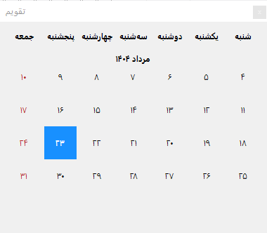
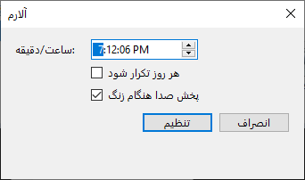
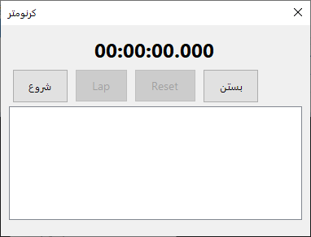
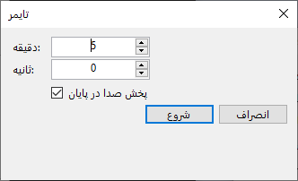
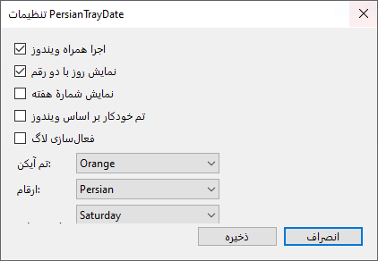
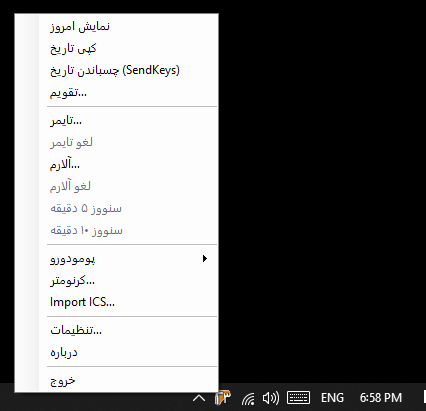

# PersianTrayDate
نمایش تاریخ شمسی (هجری خورشیدی) در **System Tray/Quick Launch** ویندوز با نام‌های فارسی. به‌همراه پنجرهٔ تقویم، تایمر، آلارم با Snooze، پومودورو، کرنومتر، میان‌بُر کپی تاریخ، و تنظیمات سبک.

---

## 📦 Download

- برای مشاهده نتیجه و فایل اجرایی از پوشه SupportAndExe پیش‌نیاز را نصب کنید سپس فایل msi را اجرا کنید.
- **Portable (.zip):** از بخش **Releases** دانلود و اجرا کنید.  
  *(مثال: `PersianTrayDate_Ultimate_Final.zip`)*  
- **MSI Installer:** نسخهٔ نصبی با آیکن سفارشی و *Run at startup* از **Releases**.  
> لینک‌ها را پس از ساخت Release خودتان جایگزین کنید:
> - Latest portable: `https://github.com/<user>/<repo>/releases/latest`
> - Latest MSI: `https://github.com/<user>/<repo>/releases/latest`

---

## ✨ Features
- تاریخ Tray با ارقام فارسی/لاتین، تم خودکار/دستی و گزینهٔ نمایش دو‌رقمی روز.
- پاپ‌آپ **تقویم** با نام روزهای هفته و هایلایت امروز.
- **تایمر** و **آلارم** (با گزینهٔ تکرار روزانه و Snooze).
- **پومودورو** (۲۵/۵) و **کرنومتر** با Lap.
- **میان‌بُر جهانی:** `Ctrl + Alt + D` (کپی تاریخ به کلیپ‌بورد).
- **Import ICS** و نمایش رویداد آینده.
- تنظیمات: شروع همراه ویندوز، نمایش شمارهٔ هفته، ارقام، تم، شروع هفته و لاگ.
- **About:** `tirotir.ir` — آیکن سفارشی **tirotir.ico**.

---

## 🚀 Quick start
1) فایل پرتابل را استخراج کنید.  
2) `PersianTrayDate.exe` را اجرا کنید.  
3) با **کلیک چپ** روی Tray آیکن ← تقویم؛ **کلیک راست** ← منو.

**Hotkeys**
- کپی تاریخ: `Ctrl + Alt + D`  
- Paste تاریخ (از منو): متن تاریخ در کلیپ‌بورد قرار می‌گیرد و با `Ctrl+V` قابل چسباندن است.

---

## 🛠 Build from source
پیش‌نیاز: **.NET 8 SDK** (Windows)

```bat
dotnet publish PersianTrayDate/PersianTrayDate.csproj ^
  -c Release -r win-x64 --self-contained true ^
  -p:PublishSingleFile=true -o publish-x64
```

> برای آیکن برنامه، `Assets/tirotir.ico` در `.csproj` به عنوان `<ApplicationIcon>` ست شده باشد.

---

## 🧰 MSI (اختیاری)
اگر از **Advanced Installer** استفاده می‌کنید:
- **Product Icon** را روی `Assets/tirotir.ico` بگذارید.
- Shortcutها (Start Menu/Desktop) را هم به همین آیکن اشاره دهید.
- گزینهٔ **Run at startup** را به HKCU\...\Run اضافه کنید (یا از تنظیمات داخلی برنامه استفاده کنید).

---

## ⚙️ Settings (خلاصه)
- **Start with Windows**: اجرا همراه ویندوز  
- **Two-digit day**: نمایش روز با دو رقم  
- **Show week number**: نمایش شمارهٔ هفته  
- **Numerals**: Persian / Latin  
- **Theme**: Blue / Green / Purple / Orange / Auto  
- **Week starts on**: Saturday / Sunday / Monday  
- **Logging**: فعال‌سازی لاگ (برای عیب‌یابی)

---

## 📸 Screenshots
<table>
  <tr>
    <td align="center">
      <br/>
      <sub>Popup Calendar</sub>
    </td>
    <td align="center">
      <br/>
      <sub>Alarm</sub>
    </td>
    <td align="center">
      <br/>
      <sub>Stopwatch</sub>
    </td>
  </tr>
  <tr>
    <td align="center">
      <br/>
      <sub>Timer</sub>
    </td>
    <td align="center">
      <br/>
      <sub>Settings</sub>
    </td>
    <td align="center">
      <br/>
      <sub>Tray Menu</sub>
    </td>
  </tr>
</table>

---

## ❗ Troubleshooting
- **عنوان روزهای هفته نمی‌افتد در یک خط**: عرض فرم بزرگ‌تر شود؛ در نسخهٔ فعلی هدر جداگانه و مقیاس‌پذیر است.  
- **فقط یک رقم در Tray می‌بینم**: رندر دو-سلولی اعداد فعال است؛ اگر DPI خیلی بالا بود، از تنظیم **Two-digit day** کمک بگیرید.  
- **ObjectDisposedException هنگام خروج**: در `Cleanup()` ترتیب Dispose اصلاح شده (اول `NotifyIcon.Icon = null`، سپس `Visible=false` و `Dispose()`).

---

## 📄 License
مجوز **MIT**

---

## 👤 About
ساخته‌شده با ❤️ — `tirotir.ir`
